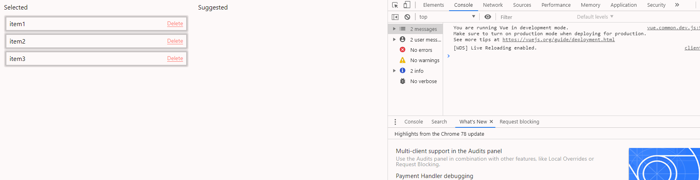

# Repro for the question: "Dynamic function for Vuex store module on floating undo bar example
"

## Install dependencies and run

```
npm i && npm run JavaScriptBuild
```

Once webpack will build the JavaScript bundle, please see the result on http://localhost:8081/


## How to check the error



1. Please open the developer tools in you browser then delete any item in cards layout.
2. Click "Undo" on popup that appears below.